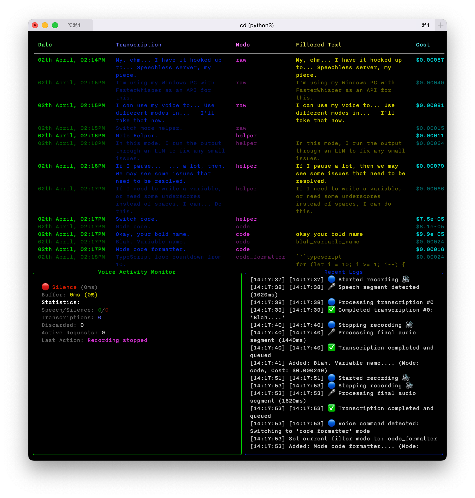
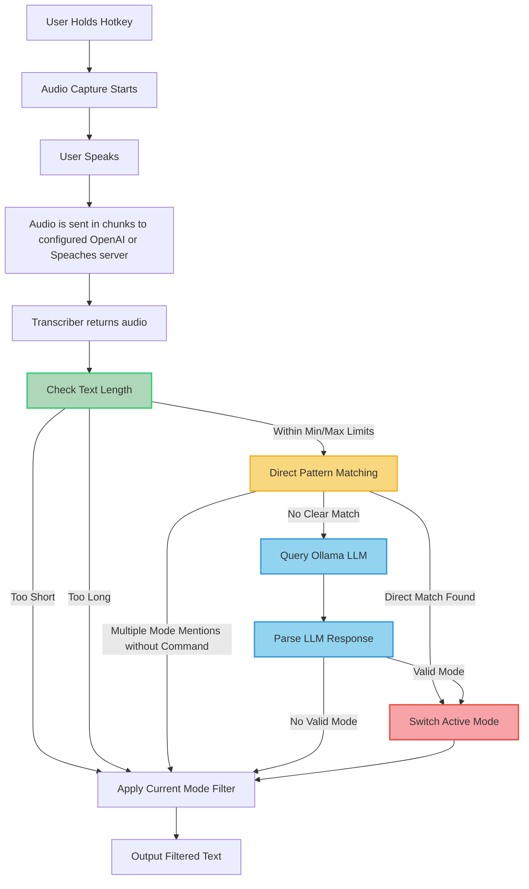

# Utterly Easy Typed ([demo](https://www.youtube.com/watch?v=eSDYIFzU_fY))  
[](./assets/sample_terminal.png)  
Fork of the beautifully basic and transparent [Uttertype](https://github.com/dhruvyad/uttertype) dictation tool.

Added features:
- basic voice command detection to decide which of the modes to use
- post-processing modes to clean or format text how you require
- bit more insight into what's happening through the UI.
  
Planned:
- [ ] Better Language (Dutch) support 
- [ ] TTS confirmation of mode switching.  
  
  

  
  
  
> 🚧  > Note that the current state isnt very plug and play yet andy you may still find issues, duplicate params, etc.  
  
  
  
## Setup  
  
  
### 1. [Install PortAudio/PyAudio](https://people.csail.mit.edu/hubert/pyaudio/)  
  
#### macOS  
Installing portaudio on macOS can be somewhat tricky, especially on M1+ chips. In general, using conda seems to be the safest way to install portaudio  
```  
conda install portaudio  
```  
  
#### Windows  
```  
python -m pip install pyaudio  
```  
  
#### Linux  
```  
sudo apt-get install python3-pyaudio  
```  
  
### 2. Add a HotKey  
For macOS, the hotkey is automatically set to the globe key by default (&#127760; bottom left key). For Windows and Linux, you can configure the hotkey by setting the `UTTERTYPE_RECORD_HOTKEYS` environment variable in `.env`:  
```env  
UTTERTYPE_RECORD_HOTKEYS="<ctrl>+<alt>+v"  
```  
  
For more context, view the [pynput documentation for using HotKeys](https://pynput.readthedocs.io/en/latest/keyboard.html#global-hotkeys) (HoldHotKey is extended from this class).  
  
### 3. Install Dependencies  
Choose one of the following methods to install the required dependencies:  
  
#### Option A: Using pip  
```shell  
python -m pip install -r requirements.txt```  
  
#### Option B: Using pipenv  
First, install pipenv if you haven't already:  
```shell  
pip install pipenv```  
  
Then, install dependencies using pipenv:  
```shell  
pipenv install```  
  
This will create a virtual environment and install all dependencies from the Pipfile. To activate the environment:  
```shell  
pipenv shell```  
  
  
If during/after installation on Linux you see error similar to:  
```  
ImportError: /home/soul/anaconda3/lib/libstdc++.so.6: version `GLIBCXX_3.4.32' not found (required by /lib/x86_64-linux-gnu/libjack.so.0)  
```  
Check out [StackOverflow](https://stackoverflow.com/questions/72540359/glibcxx-3-4-30-not-found-for-librosa-in-conda-virtual-environment-after-tryin) and [Berkley](https://bcourses.berkeley.edu/courses/1478831/pages/glibcxx-missing)  
  
  
### 4. Configure OpenAI Settings  
  
You can configure uttertype to work with either OpenAI's official API or a local Whisper server. There are two ways to set this up:  
  
#### Option A: Using a .env file (Recommended)  
Create a `.env` file in the project directory with these settings:  
  
```env  
# 1. Required: Your API key  
OPENAI_API_KEY="sk-your-key-here"  
  
# 2. Optional: Choose your API endpoint  
# For OpenAI's official API (default):  
OPENAI_BASE_URL="https://api.openai.com/v1"  
# OR for a local [Faster Whisper server](https://github.com/fedirz/faster-whisper-server):  
OPENAI_BASE_URL="http://localhost:7000/v1"  
  
# 3. Optional: Select your preferred model  
# For OpenAI's official API:  
OPENAI_MODEL_NAME="whisper-1"  
# OR for local Whisper server, some options include:  
OPENAI_MODEL_NAME="Systran/faster-whisper-small"  
OPENAI_MODEL_NAME="Systran/faster-distil-whisper-large-v3"  
OPENAI_MODEL_NAME="deepdml/faster-whisper-large-v3-turbo-ct2"  
```  
  
#### Option B: Using Environment Variables  
You can also set these values directly in your terminal:  
  
For Linux/macOS:  
```shell  
export OPENAI_API_KEY="sk-your-key-here"export OPENAI_BASE_URL="https://api.openai.com/v1" # optionalexport OPENAI_MODEL_NAME="whisper-1" # optional```  
  
For Windows:  
```shell  
$env:OPENAI_API_KEY = "sk-your-key-here"  
$env:OPENAI_BASE_URL = "https://api.openai.com/v1"  # optional  
$env:OPENAI_MODEL_NAME = "whisper-1"  # optional  
```  
  
See [`.sample_env`](.sample_env) in the repository for example configurations.  
  
#### Using a Local Whisper Server  
For faster and cheaper transcription, you can set up a local [faster-whisper-server](https://github.com/fedirz/faster-whisper-server). When using a local server:  
  
1. Set `OPENAI_BASE_URL` to your server's address (e.g., `http://localhost:7000/v1`)  
2. Choose from supported local models like:  
   - `Systran/faster-whisper-small` (fastest)  
   - `Systran/faster-distil-whisper-large-v3` (most accurate)  
   - `deepdml/faster-whisper-large-v3-turbo-ct2` (almost as good, but faster)  
  
### 5. Final run and permissions  
Finally, run main.py  
```shell  
python main.py```  
OR  
```shell  
./start_uttertype.sh # installed and configured pipenv environment would be needed```  
  
When the program first runs, you will likely need to give it sufficient permissions. On macOS, this will include adding terminal to accessibility under `Privacy and Security > Accessibility`, giving it permission to monitor the keyboard, and finally giving it permission to record using the microphone.  
  
## Usage  
To start transcription, press and hold the registered hotkey to start recording. To stop the recording, lift your registered hotkey. On macOS, the registered hotkey is the globe icon by default. For other operating systems, this will have to by manually configured in `main.py` as described earlier.  
  
## Text Filtering  
  
uttertype now includes text filtering capabilities that process your transcribed text according to different modes:  
  
### Available Filter Modes  
  
- **raw**: No modification to the transcribed text  
- **code**: Converts text to snake_case, ideal for coding  
- **helper**: Aims to smooth out any dictation quirks  
- **code_formatter**: Converts natural language to working code  
- **grammar**: Corrects grammar and improves text readability  
  
### Environment Variables for Ollama Filters  
  
You can customize Ollama filter behavior with these environment variables:  
  
```env  
# Base Ollama settings  
OLLAMA_BASE_URL="http://localhost:11434"  
OLLAMA_TIMEOUT="10"  
OLLAMA_USE_CHAT_API="true"  
  
# Model selection  
OLLAMA_MODEL="llama3:8b"  # Default model  
OLLAMA_CODE_MODEL="codellama:7b-instruct"  # For code generation  
OLLAMA_GRAMMAR_MODEL="llama3:8b"  # For grammar correction  
  
# Parameters  
OLLAMA_CODE_TEMP="0.1"  
OLLAMA_CODE_TOP_P="0.9"  
OLLAMA_CODE_TOP_K="40"  
OLLAMA_GRAMMAR_TEMP="0.3"  
```  
  
These settings can be added to your `.env` file.